

  

    <a href="/projects/stirling-engine">Stirling Engine →</a>
    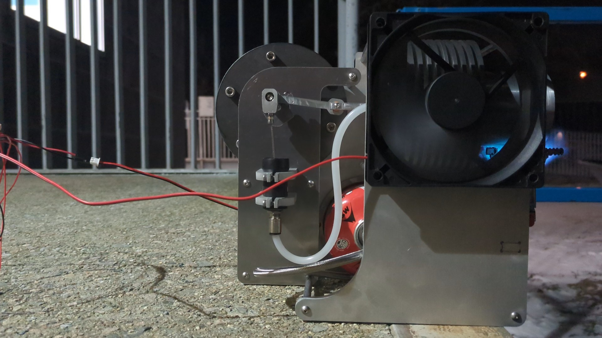
  

  

    <a href="/projects/COUCH">Control Oriented Universal Chassis Hub (COUCH) Lab →</a>
    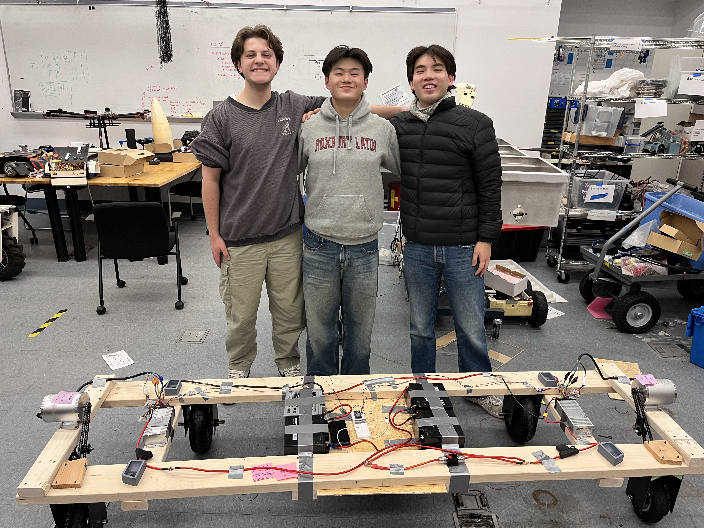
  

  

    <a href="/projects/motor-tester">Robotic Arm Motor Test Rig →</a>
    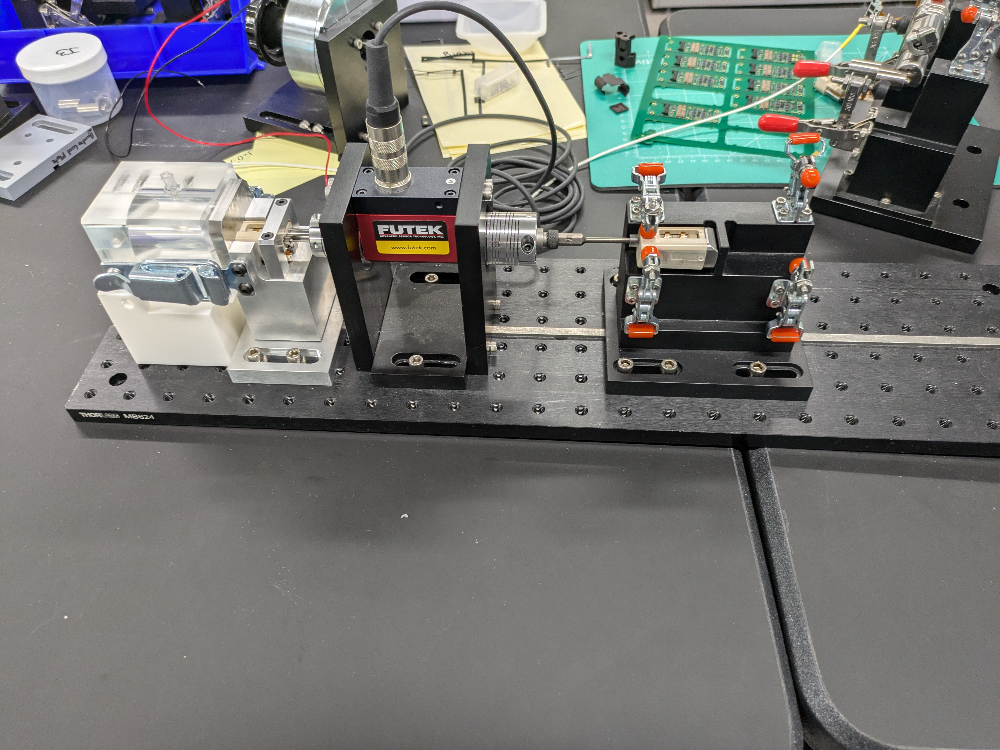
  

  

    <a href="/projects/pump">Pump up the Jam!!! →</a>
    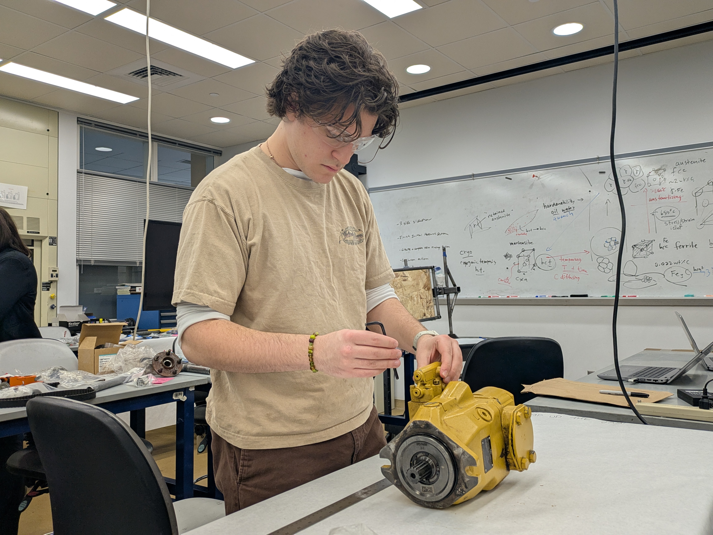
  

  

    <a href="/projects/teapot">The Case of the Leaky Teapot →</a>
    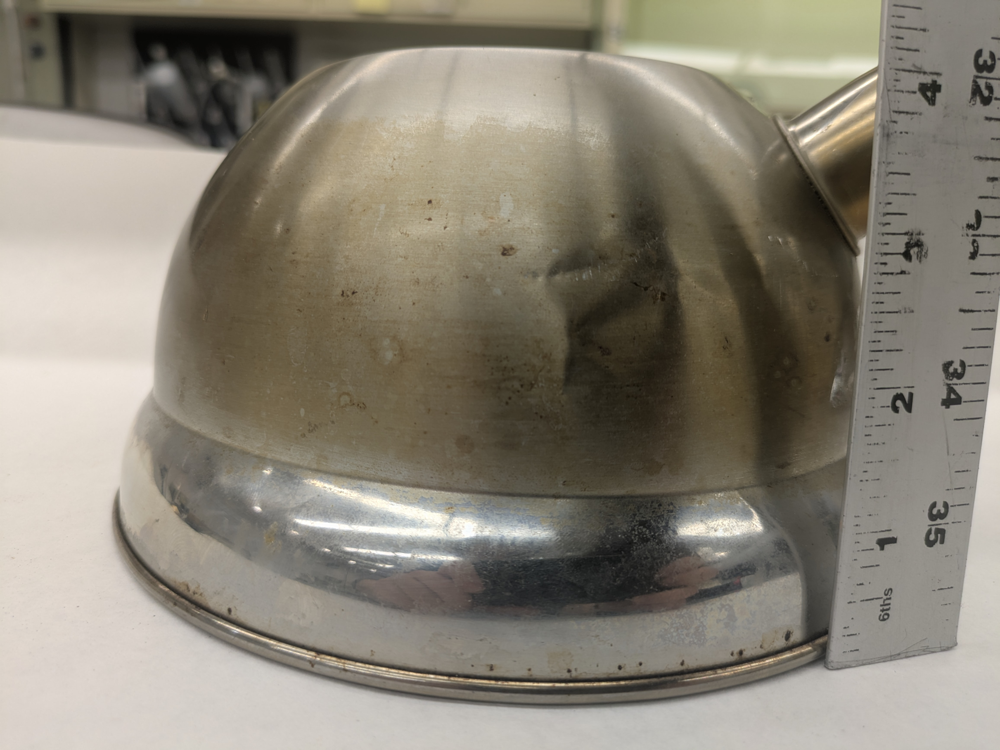
  

  

    <a href="/projects/ode45">I (re)made ode45! →</a>
    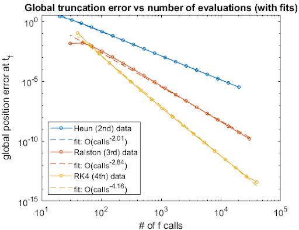
  

  

    <a href="/projects/swish">A swish, every time. →</a>
    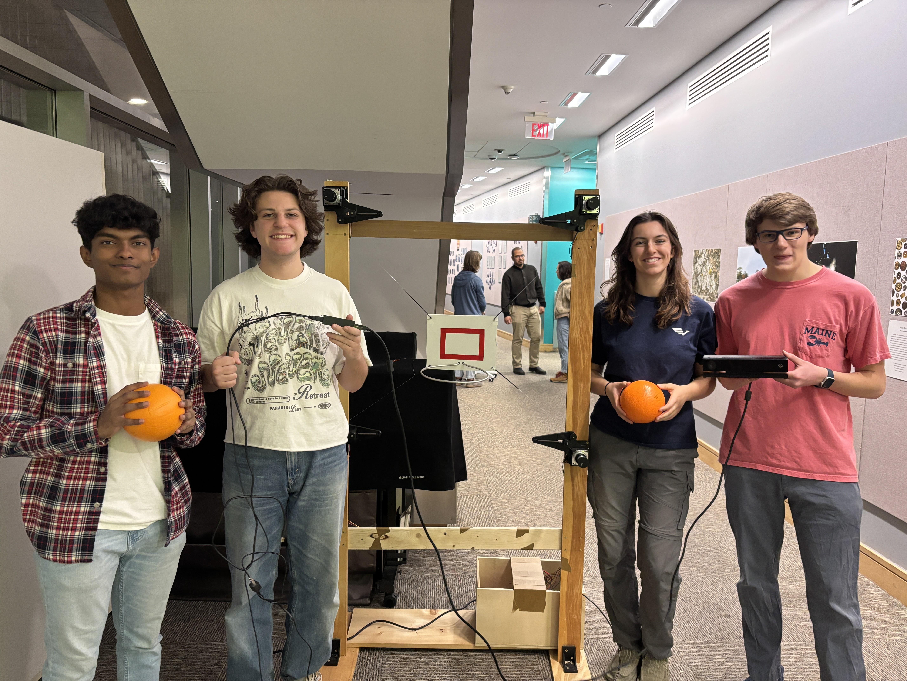
  

  

    <a href="/projects/scanner">3D Scanner in 2 Weeks →</a>
    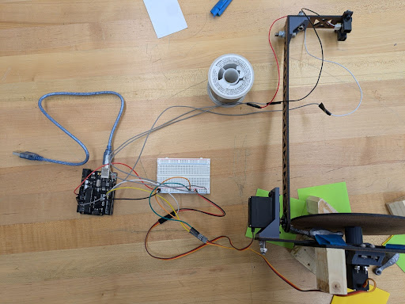
  

  

    <a href="/projects/grabber">Kinematic Arm Autonomous Weeding Robot →</a>
    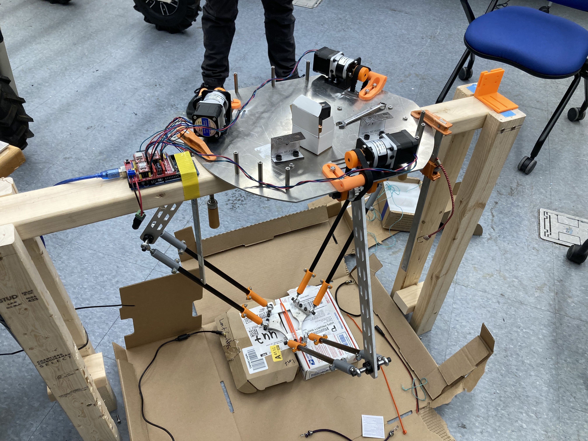
  

  

    <a href="/projects/solar">Modular Solar System →</a>
    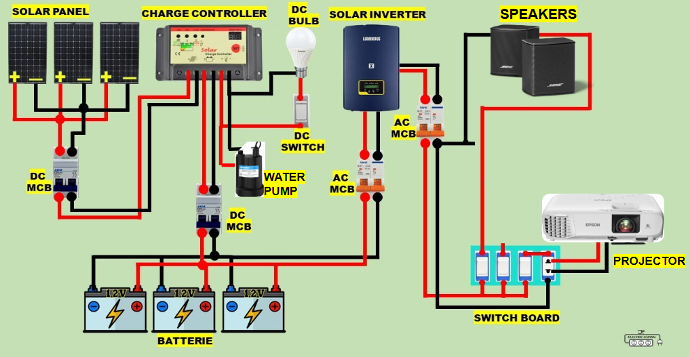
  

  

    <a href="/projects/clock">3D Printed Pendulum Clock →</a>
    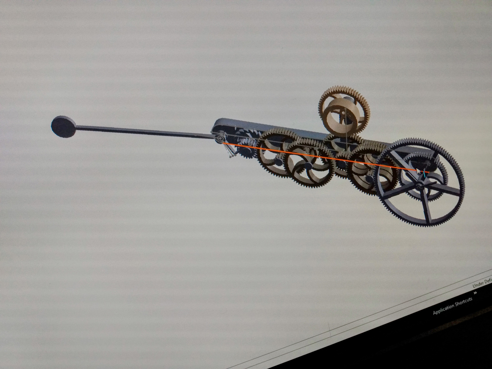
  

  

    <a href="/projects/rollerskates">Make Your Own Rollerskates →</a>
    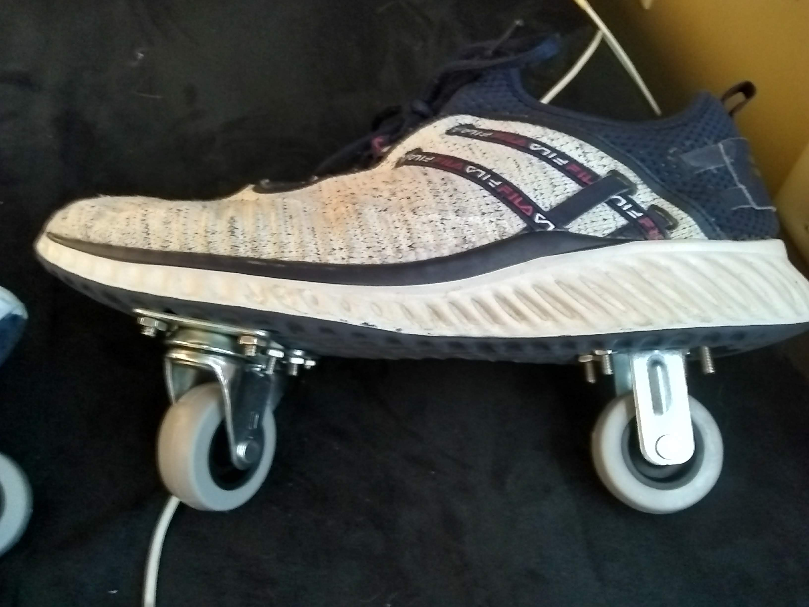
  

<a href="/">← Back to Home</a>

